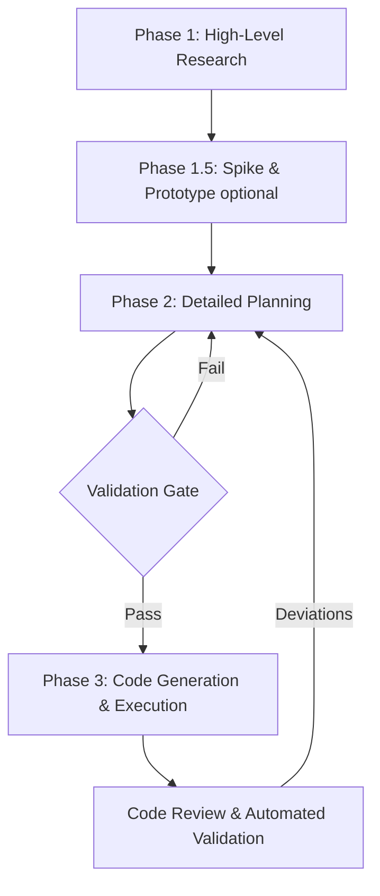

# LLM-Assisted Feature Development Workflow

This document serves as the single source of truth for developing new features using GitHub Copilot. It merges best practices from multiple analyses into a streamlined, highly effective workflow.

## Overview

The core philosophy separates work across cognitive levels: **Strategy → Design → Implementation**. By producing intermediate artifacts (documents), we provide high-quality context for the LLMs at each step, significantly reducing context drift and hallucination.

### The 5-Step Workflow

---

## Phases & Execution

### Phase 1: High-Level Research & Roadmap
**Goal:** Understand the domain, modern techniques, and outline a high-level architecture without writing production implementation details.
- **Process:** Ask the LLM to act as a Principal Architect to survey the topic and propose structural roadmaps.
- **Output:** A high-level roadmap document (e.g., `agentic-ai-learning-roadmap.md`).
- **Recommended Model:** **Gemini 2.5 Pro** (or Gemini 3.1 Pro Preview). They excel at synthesizing large contexts and generating broad, creative architectural ideas. *Fallback: Claude Sonnet 4.6.*

### Phase 1.5: Spike & Prototype (Optional but Recommended)
**Goal:** Mitigate risks for unfamiliar APIs or complex technical challenges before committing to a plan.
- **Process:** Generate quick, throwaway proof-of-concept scripts to validate assumptions.
- **Output:** Quick unpolished code or a technical memo validating the approach.
- **Recommended Model:** **GPT 4.1**. Fast, cost-effective, and sufficient for throwaway exploration.

### Phase 2: Detailed Planning
**Goal:** Translate the roadmap into a concrete, phased implementation plan and technical specification.
- **Process:** Break the roadmap milestone into specific implementation phases. Include framework selection, architectural decisions, and acceptance criteria.
- **Validation Gate:** Before moving to code, cross-check this plan against project constraints (free-tier limits, local-first preference, etc. as defined in `AGENTS.md`).
- **Output:** A detailed milestone plan with test scenarios (e.g., `llm-observability-design.md`).
- **Recommended Model:** **Claude Sonnet 4.6**. Unmatched logic, structure, and instruction-following for technical specification writing. *Use GPT 5.4 for extremely complex, multi-system designs.*

### Phase 3: Code Generation & Execution
**Goal:** Write production-ready code step-by-step based strictly on the Phase 2 document.
- **Process:** Instruct the coding agent to handle **one phase/step at a time**. Provide `AGENTS.md` and the Phase 2 plan as context.
- **Feedback Loop:** Treat the design docs as living documents. If the LLM coding agent encounters an issue requiring architectural changes, explicitly direct it to update the Phase 2 planning document.
- **Output:** Application code, unit tests, and validation.
- **Recommended Model:** **GPT 5.3 Codex**. Highly optimized for code generation, syntax accuracy, and repository-aware editing. *Use Claude Sonnet 4.6 for complex multi-file refactoring workflows.*

---

## Recommended Model Matrix

| Phase | Task | Primary Model | Fallback Model |
|-------|------|---------------|----------------|
| **1. Research** | Broad research, synthesis, roadmap creation | **Gemini 2.5 Pro** | Claude Sonnet 4.6 |
| **1.5 Prototyping**| Throwaway spikes for risk validation | **GPT 4.1** | GPT 5.2 |
| **2. Planning** | Structured tech specs, phased implementation | **Claude Sonnet 4.6** | GPT 5.4 |
| **3. Coding** | Implementing code with existing repo context | **GPT 5.3 Codex** | GPT 5.2 Codex |
| **Refactoring** | Multi-file changes, test writing, consistency | **Claude Sonnet 4.6** | GPT 5.3 Codex |

---

## Best Practices & Automation Rules

1. **Context is King:** Always pass the project constraints (`AGENTS.md`) and the output of the previous phase to the LLM. Quality inputs = quality outputs.
2. **Step-by-Step Execution:** Do not ask an agent to "implement this entire document." Ask it to implement "Phase 1, Step 1" and wait for validation.
3. **Tests First (Not Afterthoughts):** Define test scenarios in Phase 2. Write test cases before or alongside code implementation in Phase 3.
4. **Automated Validation:** After coding, run linters (`make test-unit`), formatters, and type-checkers. Feed errors directly back into the Codex agent to fix.
5. **Living Documentation:** If code reality differs from the plan, use an agent to update the planning documentation. Keep the source of truth synchronized.
